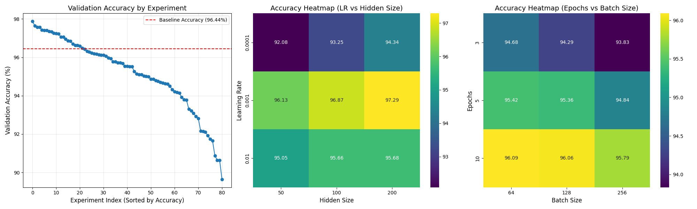
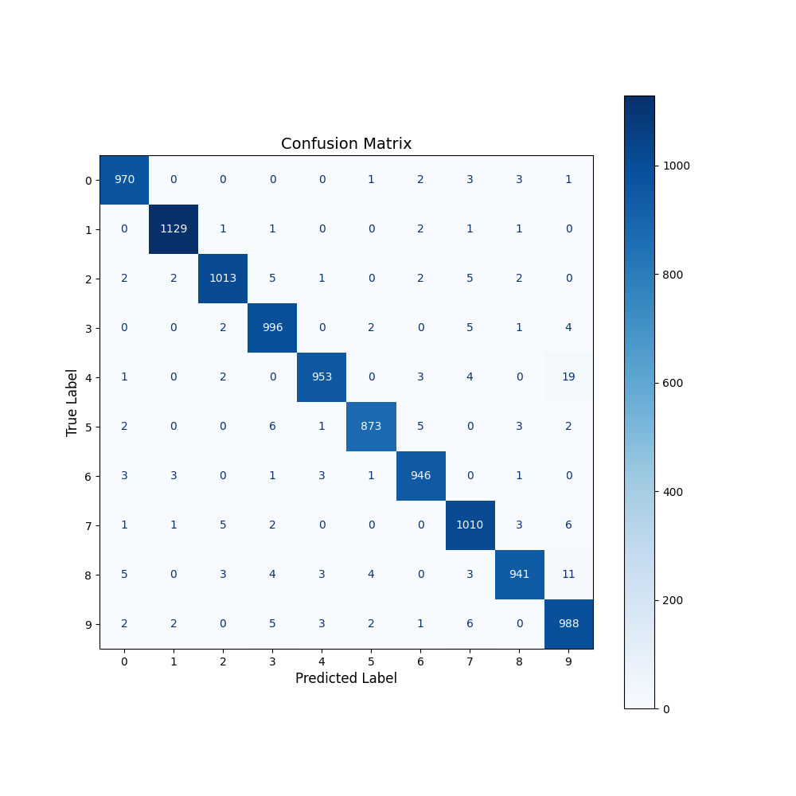

# MNIST 분류 실험 결과 (202400190 최서연)

## 기본 모델 성능
- **기본 파라미터:** 
{'lr': 0.001, 'hidden_size': 100, 'epochs': 3, 'batch_size': 128}
- **최종 테스트 정확도:** 96.44%  
- **훈련 시간:** 41.83초

## 실험 환경
- **실행 환경:** Google Colab
- **GPU:** Nvidia T4
- **재현성 seed:** 11

## 데이터 분할
- **Train set:** 55000개
- **Validation set:** 5000개
- **Test set:** 10000개

## 패키지 버전 확인
- python: 3.12.11
- torch: 2.8.0+cu126
- torchvision: 0.23.0+cu126
- datasets: 4.0.0
- numpy: 2.0.2
- pandas: 2.2.2
- matplotlib: 3.10.0
- seaborn: 0.13.2
--------------------

## 실험 결과

### 실험 1: 하이퍼파라미터 튜닝 (Grid Search)
- **변경사항:**  
  - Learning rate: [1e-2, 1e-3, 1e-4]  
  - Hidden layer size: [50, 100, 200]
  - Epochs: [3, 5, 10] 
  - Batch size: [64, 128, 256]
  → 각 하이퍼파라미터 값들은 서로 독립적이지 않고 상호 영향을 줄 것이라고 생각해 실험을 독립적으로 실행하지 않고, 하이퍼파라미터 값들의 조합으로 3x3x3x3, 총 81번의 학습을 진행 후 결과를 기록했습니다.

  
 
  - **최종 테스트 정확도: 97.88% (Best)**
  - `lr=1e-3`, `hidden_size=200`, `epoch=10`, `batch=64` 조합에서 최고 성능  
  
- **결과 분석**  
  - 학습률이 1e-3인 구간에서 가장 뛰어난 성능을 보였습니다. 1e-4의 학습률로는 주어진 에포크 내에 충분한 학습이 이루어지지 못 했고, 1e-2의 학습률은 진동이나 발산을 일으켰을 것으로 생각됩니다.
  - 은닉층의 크기는 커질수록 좋은 성능을 보였습니다.
  - 에포크 또한 많을수록 성능이 향상되었습니다.
  - 배치 크기의 경우 작은 사이즈(64)에서 가장 좋은 성능이 나왔습니다. 배치 사이즈를 줄임으로써 학습 과정에 노이즈를 추가하여 모델이 local minimum이 아닌 global minimum에 가까워졌던 것으로 보입니다.
  - 대부분의 val_acc와 best_acc가 일치하는 것으로 보아, 제가 지정한 하이퍼파라미터 값들은 해당 에포크 내에서 overfitting이 일어날 정도로 학습이 충분히 진행되지 않은 것으로 보입니다.
  - 가장 높은 성능을 보인 모델의 파라미터가 경곗값에 위치해있어, hidden_size와 epoch는 늘리고, batch_size는 더 줄인다면 더 좋은 성능을 내는 모델을 찾을 가능성이 있는 것 같습니다. 

---

### 실험 2-1: 은닉층 깊이 추가 (1 → 3)
- **변경사항:** 은닉층 1개 → 3개로 변경  

- **결과:**  
Epoch : 10, Loss: 0.0211, Val Acc: 98.16% (Best: 98.16%)

- **결과 분석**  
  - 실험1에서의 Best Model(97.88%)보다 높은 성능을 보였습니다.
  - 은닉층을 쌓음으로써 모델의 표현력이 증가한 것으로 보입니다.
  - 앞서 진행한 실험1에서의 모델 학습량이 많아 상대적으로 실험2는 가볍게 진행하였는데, 은닉층 깊이를 더 늘려가며 실험을 추가적으로 진행해 Overfitting이 되는 지점을 찾고 정규화를 진행해본다면 좋을 것 같습니다.

---

### 실험 2-2: 활성화 함수 변경 (ReLU → Sigmoid, Tanh)
- **변경사항:** 활성화 함수를 ReLU에서 Sigmoid, Tanh로 변경하였습니다.

- **결과:**  
(ReLU -> Sigmoid) Epoch : 10, Loss: 0.0215, Val Acc: 97.52% (Best: 97.52%)
(ReLU -> Tanh) Epoch : 10, Loss: 0.0165, Val Acc: 97.30% (Best: 97.44%)

- **결과 분석:**  
  - Sigmoid(97.52%), Tanh(97.44%)와 비교 시, 기존 모델에 사용된 ReLU(97.88%)가 가장 높은 성능을 보였습니다.
  - 각 layer에 맞게 활성화 함수를 사용하는 실험도 추가로 진행해보면 좋을 것 같습니다.
  (은닉층에서는 ReLu 함수를 쓰고, 출력층에서는 softmax 함수를 쓰는 등)

---

### 실험 2-3: Dropout 적용 (p=0.5)
- **변경사항:** 은닉층 뒤에 Dropout(0.5) 추가  

- **결과:**  
Epoch : 10, Loss: 0.1001, Val Acc: 97.48% (Best: 97.64%)

- **결과 분석**  
  - Dropout을 도입하였으나, Best Model(97.88%)보다 성능이 저하되었습니다.
  - 앞서 진행했던 실험의 분석을 바탕으로 성능이 낮아진 이유를 살펴보자면, overfitting이 진행되지 않은 상태에서 Dropout을 도입한 것으로 보입니다.

---

### 추가 실험: 은닉층 추가 + 드롭아웃 추가 + 하이퍼파라미터 변경
- **변경사항:** 
앞서 진행한 실험의 결과를 분석 후 추가적인 실험을 진행하였습니다. 가장 높은 성능을 보인 2-1 실험의 은닉층 3개 모델을 기본 구조로 선택하였습니다. 기존 실험에서 overfitting이 관찰되지 않았으므로, 학습이 충분히 진행되지 않은 것으로 보여 에포크를 추가하였습니다. 에포크가 추가됨에 따라 발생할 수 있는 overfitting의 가능성을 줄이기 위해 Dropout을 도입하고, 학습률을 감소시켜 모델이 더 안정적으로 학습할 수 있도록 하였습니다.

- **결과:**  
Epoch : 20, Loss: 0.0277, Val Acc: 98.18% (Best: 98.36%)

- **결과 분석**  
  - Val_acc가 98.36%로, 기존의 가장 높은 성능을 가진 모델(98.16%)보다 좋은 성능을 보였습니다.
  - 모델의 표현력은 늘리고 학습을 충분히 시키면서 overfitting은 성공적으로 억제한 결과로 보입니다.

---

- Confusion Matrix를 통해 단순히 정확도만을 봐서는 알 수 없는 정보를 추가적으로 얻을 수 있습니다.
- 여기서는 모델이 유독 '4'를 '9'로 잘못 감지하는 경향이 보입니다.
- 이런 경우 '4'와 '9'의 데이터 양을 늘리는 등의 방법을 통해 모델을 개선할 수 있습니다.

---

## 결론 및 인사이트
- **가장 효과적인 개선 방법:**  
  - [추가 실험]의 모델이 가장 성능이 좋았습니다. (val_acc : 98.36%)
  - 최종 모델 파라미터 : {'learning rate': 0.0005, 'hidden_size': 200, 'epochs': 20, 'batch_size': 64, 'num_hidden_layers': 3, 'dropout_p': 0.2}

- **관찰된 패턴:**  
  - 하이퍼파라미터와 모델 구조와 같은 여러 요소들이 독립적으로 작용하는 것이 아니라, 모든 요소가 서로 유기적으로 연결되어 있습니다. 최적의 모델을 찾는 것은 그 균형점을 찾는 과정인 것 같습니다. (단순히 모델의 은닉층 개수를 늘린다고 해서 성능이 좋아진다는 걸 보장할 수 없고, overfitting이 발생할 경우 또 다른 하이퍼파라미터의 변경이나 Dropout과 같은 기법의 도입을 필요로 합니다.)

- **추가 개선 아이디어:**  
  - 지금까지는 미리 고정한 값들을 바탕으로 훈련을 진행했지만, layer에 맞는 활성화함수를 사용하고 훈련 중에 학습률을 조정하는 등의 훈련 상황에 맞게 파라미터를 조절하는 동적인 방식의 실험도 진행해보고 싶습니다.

---

기존 ml-mnist 파일 코드의 모듈화와 추가 실험 진행을 위한 새로운 model을 정의하는 코드, 그리고 실험 결과를 시각화하는 코드의 작성 및 디버깅은 Gemini의 도움을 받았습니다.