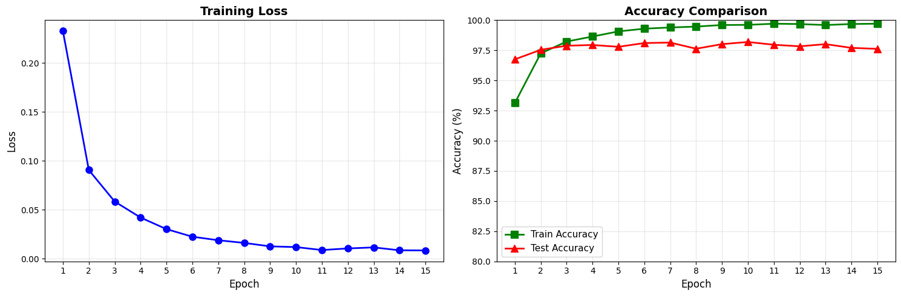

# MNIST 분류 실험 결과

## 기본 모델 성능
- 최종 테스트 정확도: 96.81%
- 훈련 시간: 46초

## 실험 결과

### 실험 1: 학습률(Learning Rate) 변경
- **변경사항**: 기준값인 1e-3을 포함하여, 총 6개의 다른 학습률(1e-2, 5e-3, 1e-3, 5e-4, 1e-4, 1e-5)을 적용하여 모델을 훈련하였다.
- **결과**:
  
| 학습률 | 최종 테스트 정확도 | 최종 훈련 정확도 | 과적합 정도 (훈련-테스트) | 훈련 시간 |
| :---: | :---: | :---: | :---: | :---: |
| 1e-2 (0.01) | 95.71% | 96.11% | +0.40% | 48초 |
| 5e-3 (0.005) | 96.47% | 97.15% | +0.68% | 46초 |
| **1e-3 (0.001)** | **96.91%** | **96.89%** | **-0.02%** | **45초** |
| 5e-4 (0.0005) | 96.32% | 95.96% | -0.36% | 48초 |
| 1e-4 (0.0001) | 92.53% | 91.79% | -0.74% | 47초 |
| 1e-5 (0.00001) | 85.14% | 82.52% | -2.62% | 47초 |
- **분석**: 학습률 1e-3 (0.001)에서 최종 테스트 정확도 96.91%로 가장 높은 성능을 기록했으며, 과적합도 거의 발생하지 않았다.(-0.02%). 이보다 학습률이 높거나 낮아질 경우 모두 성능이 하락하는 경향을 보였다. 이번 실험을 통해 학습률이 모델 성능에 매우 중요한 영향을 미친다는 것을 확인했다. 학습률이 1e-3보다 높을 경우, 최적점을 지나쳐 버리는 현상으로 인해 성능이 저하되었다. 반대로 1e-4 이하로 너무 낮아질 경우, 제한된 학습 횟수 내에 모델이 충분히 배우지 못하는 상태에 빠져 정확도가 급격히 하락했다. 따라서 본 모델과 데이터셋에서는 1e-3이 가장 이상적인 학습률임을 알 수 있다.

### 실험 2: 은닉층 크기(Hidden Size) 변경
- **변경사항**: 실험 1의 가장 높은 성능을 보인 학습률(1e-3)을 기준으로 모델의 은닉층(Hidden Layer) 뉴런 개수를 50, 100, 200, 300, 500으로 총 5가지 다르게 설정하여 모델을 훈련하였다.
- **결과**:
  
| 은닉층 크기 | 최종 테스트 정확도 | 총 파라미터 수 | 과적합 정도 (훈련-테스트) | 훈련 시간 |
| :---: | :---: | :---: | :---: | :---: |
| 50 | 95.81% | 39,760 | +0.09% | 50초 |
| 100 | 97.13% | 79,510 | -0.11% | 47초 |
| 200 | 97.59% | 159,010 | +0.02% | 47초 |
| 300 | 97.82% | 238,510 | +0.12% | 46초 |
| 500 | 97.84% | 397,510 | +0.39% | 46초 |
- **분석**: 은닉층의 크기가 커질수록 모델의 전반적인 테스트 정확도가 상승하는 경향을 보였으며, 뉴런 개수가 500일 때 97.84%로 가장 높은 성능을 기록했다. 특히, 모델의 크기가 50에서 100으로 증가할 때 가장 큰 폭의 성능 향상(+1.32%)이 있었다. 하지만 300에서 500으로 증가할 때는 파라미터 수가 약 16만 개나 늘어났음에도 불구하고 정확도는 0.02%만 상승하여 성능 향상에 한계가 존재함을 확인했다. 또한, 모델이 커질수록 과적합 정도가 조금씩 증가하는 경향을 보여, 무작정 모델의 크기를 키우는 것보다 적절한 크기를 선택하는 것이 효율적임을 알 수 있다.

### 실험 3: 에포크(Epoch) 수에 따른 과적합 변화
- **변경사항**: 실험1과 실험 2에서 가장 높은 성능을 보인 학습률(1e-3)과 은닉층 크기(500)를 기준으로, 에포크(학습 횟수)를 3, 5, 10, 15로 다르게 설정하여 모델을 훈련하였다.
- **결과**:
  
| 에포크 수 | 최종 테스트 정확도 | 최종 훈련 정확도 | 과적합 정도 (훈련-테스트) | 훈련 시간 |
| :---: | :---: | :---: | :---: | :---: |
| 3 | 97.71% | 98.18% | +0.47% | 45초 |
| 5 | 98.09% | 99.02% | +0.93% | 1분 |
| 10 | 97.90% | 99.56% | +1.66% | 2분 |
| 15 | 97.62% | 99.70% | +2.08% | 3분 |
- **분석**: 학습 횟수를 늘림에 따라 모델의 성능 변화를 관찰한 결과, 에포크 5에서 98.09%로 가장 높은 테스트 정확도를 달성했다. 훈련 정확도는 에포크가 증가할수록 계속 상승했지만, 테스트 정확도는 5 에포크를 정점으로 오히려 하락하는 경향을 보였다.
**아래 그래프는 이러한 과적합 과정을 시각적으로 보여준다.**

이는 5 에포크 이후부터 모델이 훈련 데이터를 과도하게 암기하여 새로운 데이터에 대한 일반화 성능이 떨어지는 과적합이 심화되었기 때문이다. 과적합 정도 수치가 에포크가 증가할수록 급격하게 커지는 것을 통해 이를 명확히 확인할 수 있다. 따라서, 본 모델은 5 에포크 정도의 학습이 가장 효율적이고 높은 성능을 내는 최적점임을 알 수 있다.

## 결론 및 인사이트
- **가장 효과적인 개선 방법**: 
학습률 0.001, 은닉층 뉴런 개수를 500개, 5 에포크가 찾아 과적합을 최소화하는 것이 가장 효과적이었다. 이를 통해 최종적으로 98.09%라는 가장 높은 테스트 정확도를 달성할 수 있었다.
세 가지 요소가 모두 너무 많거나 적으면 문제가 되므로 각각 다 적절히 맞춰야 한다.
- **관찰된 패턴**: 
학습률, 은닉층 크기, 에포크 수 모두 모델 성능에 결정적인 영향을 미쳤다. 특히 학습률과 에포크 수에서는 너무 높거나 낮은 값 모두 성능 저하를 유발하는 최적점이 존재함을 명확히 확인했다.
모델이 복잡해지고 학습 횟수가 늘어날수록, 훈련 데이터에만 익숙해져 새로운 데이터에 대한 성능이 떨어지는 과적합 현상을 뚜렷하게 관찰할 수 있었다.
- **추가 개선 아이디어**: 
더 많은 에포크로 학습을 진행하면서도 과적합을 억제하기 위해, 수업 때 언급되었던 드롭아웃을 모델에 추가하는 실험을 진행해보고 싶다.
